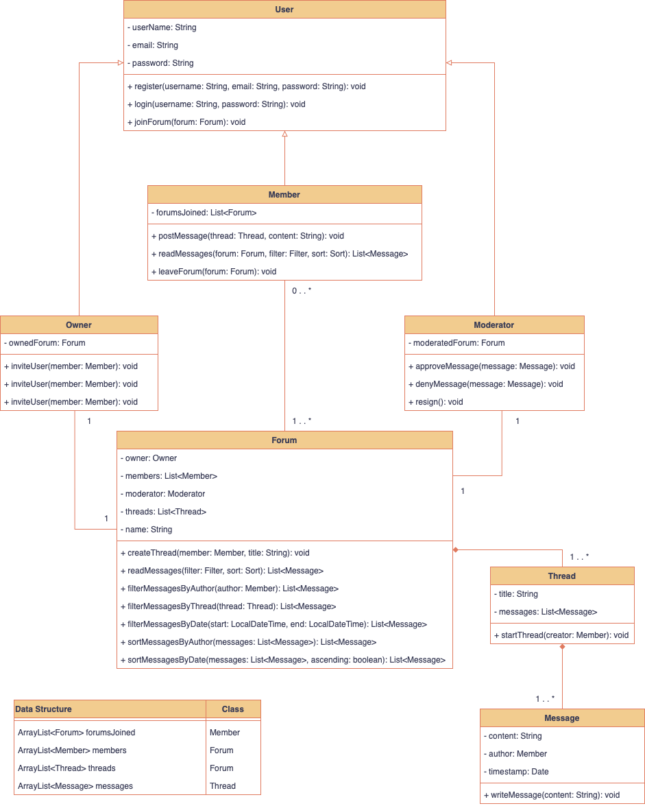

# SoftMethP2
  
UML Editor Website: https://app.diagrams.net
  
# To-Do List
- [x] Members of a forum can post messages to the forum
- [ ] Members of a forum can read messages posted by other members to the forum, filtered and/or sorted by message author, thread, or date
- [x] Members of a forum can leave a forum
- [x] Users on the website can create new forums
- [x] Users on the website can join an existing forum as member
- [x] Every forum has a single owner, who is initially the creator of the forum. The creator of a forum automatically becomes its first member.
- [x] Each forum has one moderator, who is initially the creator of the forum. Only a forum member can be its moderator.
- [x] Owners can invite users to join their forum by sending them an email invitation
- [x] Owners can invite a member to be the moderator - if the invitation is accepted, the new moderator replaces the current moderator
- [x] Owners can invite a member to take over ownership - if the invitation is accepted, the ownership is transferred to that member
- [x] Owners can delete the forum
- [x] Moderators can deny or pass through messages posted to the forum by members
- [x] Moderators can resign as moderator by sending an email to the owner, at which point the owner becomes the moderator
- [x] Usage of packages
- [ ] Usage of access levels
- [x] Object-oriented design
  
# [[ VISUAL REPRESENATION OF UML DIAGRAM ]]
 
( Click image to fully view. Diagram must be manually updated )

